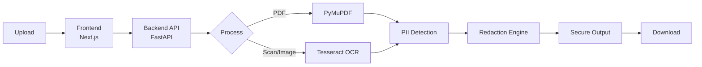

<p align="center">
  
</p>

SafeDoc is a privacy-first web application that automatically detects and permanently redacts sensitive Personally Identifiable Information (PII) from documents and images.

From Aadhaar cards and PAN numbers to bank statements and contact details, SafeDoc ensures confidential data is masked irreversibly before sharing.

---


## 🎯 Why SafeDoc?

Sharing documents often exposes sensitive personal data. Manual redaction is slow, error-prone, and sometimes reversible.

SafeDoc solves this by:

* Automatically detecting sensitive information
* Permanantly masking data so it cannot be recovered
* Processing files securely without storing them
* Supporting both digital and scanned documents

---

## 🧩 System Architecture

<p align="center">
  🔍 Scanning → 🧠 Detecting → 🧱 Redacting → 🔒 Securing → ✅ Done
</p>



**Flow:** Upload → Process → Detect → Redact → Download

---

## 🚀 Key Features

### 🔎 Advanced PII Detection

SafeDoc identifies and redacts multiple sensitive data types:

* Aadhaar Number
* PAN Number
* Passport Number
* Driving License
* Voter ID
* Phone Numbers
* Email Addresses
* Date of Birth
* Bank Account Numbers
* IFSC Codes

Detection uses pattern recognition, contextual matching, and OCR extraction.

---

### 📄 Smart Document Processing

#### Digital PDFs

* High-precision text extraction
* Masked replacement of sensitive text
* Preserves layout & formatting

#### Scanned PDFs

* Uses **Tesseract OCR** to detect text positions
* Applies solid black redaction masks
* Ensures sensitive content is unrecoverable

#### Image Support

Supports:

* PNG
* JPG / JPEG
* BMP
* TIFF

---


### 🔐 Password-Protected PDFs

* Detects encrypted PDFs automatically
* Secure password prompt flow
* Decrypts only in memory

---

### 🧱 Permanent Redaction Engine

SafeDoc ensures redacted data cannot be recovered:

* Text removed and replaced, not hidden
* Document layers flattened
* Metadata sanitized
* Hidden remnants garbage-collected

---

### 🔒 Privacy-First Architecture

* Files processed entirely in memory
* No permanent storage
* Temporary data wiped immediately
* Zero logging of sensitive content

---

### 🎨 Modern User Interface

* Glassmorphic UI design
* Real-time processing indicators
* Drag-and-drop upload
* Clean and intuitive workflow

---
## 🛠 Technology Stack


### Backend

**FastAPI**

* High-performance async framework
* Efficient file streaming

**PyMuPDF (fitz)**

* Text extraction & redaction
* PDF flattening & sanitization

**Tesseract OCR**

* Extracts text from scanned documents
* Provides bounding boxes for masking

**Pillow**

* Image preprocessing & conversion

---

### Frontend

**Next.js 14 (App Router)**

* Server & client rendering
* Optimized routing & performance

**Tailwind CSS**

* Utility-first styling
* Responsive UI

**Lucide Icons**

* Lightweight icon system

**Axios**

* API communication

---

## ⚙️ Installation & Setup

### Prerequisites

* Python 3.9+
* Node.js 18+
* Tesseract OCR installed & added to PATH

### Install Tesseract

**Ubuntu**

```bash
sudo apt install tesseract-ocr
```

**Mac**

```bash
brew install tesseract
```

**Windows**
Download installer and add to PATH.

---

## 🖥 Backend Setup

```bash
cd backend
python -m venv venv
source venv/bin/activate      # Windows: venv\Scripts\activate
pip install -r requirements.txt
python -m uvicorn main:app --reload --port 8000
```

Backend runs at:

👉 [http://localhost:8000](http://localhost:8000)

---

## 🌐 Frontend Setup

```bash
cd frontend
npm install
npm run dev
```

Open:

👉 [http://localhost:3000](http://localhost:3000)

---

## 🔄 Processing Workflow

1. User uploads document/image
2. Backend detects file type
3. OCR runs if document is scanned
4. PII detection engine scans extracted text
5. Redaction engine applies permanent masking
6. Flattened secure file returned
7. Temporary data destroyed

---

## 🛡 Security & Compliance

### Masking Rules

* IDs show only last 4 digits where appropriate
* Scanned content uses solid black masking
* No hidden layers remain

### Data Protection

* No file persistence
* Metadata removed
* Designed for compliance with:

  * GDPR
  * India DPDP Act
  * HIPAA-like privacy principles (design level)

---

## ⚠️ Limitations

* OCR accuracy depends on scan quality
* Handwritten text detection may vary
* Low-resolution images reduce accuracy

---

## 🔮 Future Enhancements

* AI-based contextual PII detection
* Batch processing
* Enterprise dashboard
* Offline desktop version
* End-to-end encrypted cloud deployment
* Multi-language OCR support

---

## 📄 License

This project is intended for demonstration and MVP use.

Ensure compliance with applicable data protection and privacy laws before production deployment.
